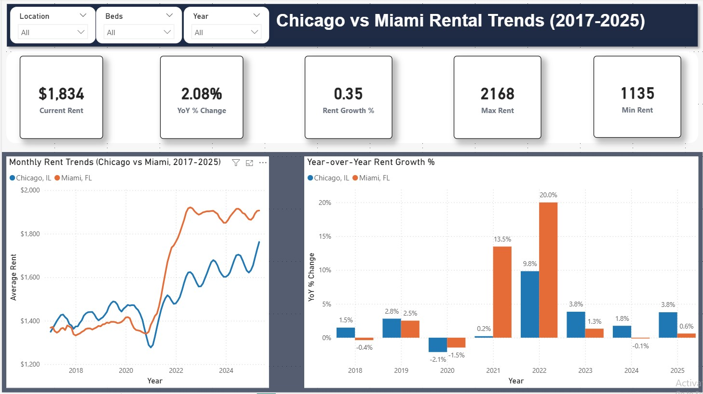

# Chicago vs Miami Rent Trends (2017–2025) – Power BI

## Project Overview
This project analyzes apartment rental trends in **Chicago, IL** and **Miami, FL** (2017–2025) using Power BI.  
It showcases skills in **data shaping (Power Query), DAX time intelligence, and executive-style dashboard design**.

## Files
- `report/Rent_Dashboard.pbix` – Power BI report (import model)
- `data/Chicago-Miami Apt List 2017_2025.xlsx` – source data
- `C:\Users\Chicago\Desktop\PORTFOLIO CHICAGO RESIDENTIAL PROJECT\Florida 2bdr\Dashboard_Page1.jpg` – preview image
- `C:\Users\Chicago\Desktop\PORTFOLIO CHICAGO RESIDENTIAL PROJECT\Florida 2bdr\Dashboard_Page2.jpg` – preview image

## Dashboard Features
- **KPIs**: Current Rent, YoY % Change, Growth since 2017, Max/Min Rent
- **Trends**: Monthly Rent (line), YoY % by Year (columns)
- **Comparisons**: Rent Index (2017), Average Rent by Bed Size (latest year)
- **Detail**: Table with rent + YoY; **Slicers**: Location, Bed Size, Year

## Analysis Highlights
- Miami rents increased more rapidly than Chicago from 2017–2025.
- Chicago experienced a larger dip during 2020–2021; both rebounded by 2022.
- 2BR units outpaced 1BR growth in both cities, indicating demand for larger spaces.

## How to Use
1. Open `report/Rent_Dashboard.pbix` in **Power BI Desktop (Windows)**.
2. Interact with slicers (Location, Bed Size, Year).
3. Hover over the trend line to view **YoY %** in tooltips.

## DAX (selected measures)
- **Average Rent**: `AVERAGE(Sheet1[Rent])`
- **YoY % Change**: uses `SAMEPERIODLASTYEAR('Date'[Date])`
- **Rent Index (2017=100)**: `( [Average Rent] / BaseRent2017 ) * 100`
- **Current Rent**: filters to the latest date in the Date table
- **Growth Since 2017**: compares latest vs first month

> Full DAX is inside the `.pbix` measures pane.

## 📷 Dashboard Preview

## Notes
- Built with import mode; the `.pbix` includes data for out-of-the-box viewing.
- If you refresh, Power BI will look for the Excel file under `data/…`.

